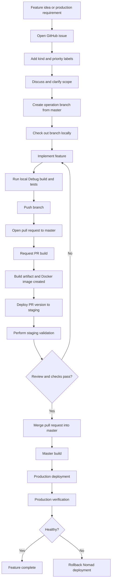
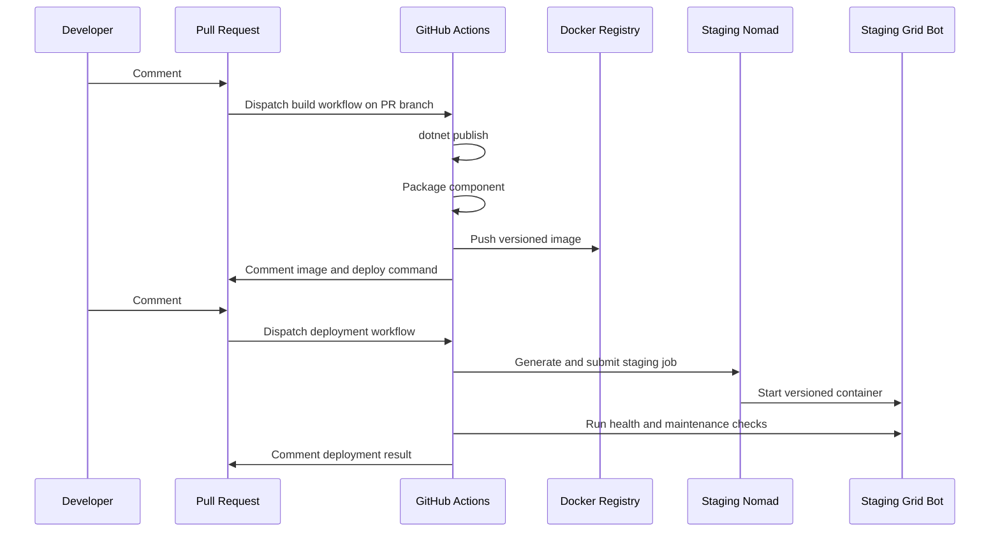
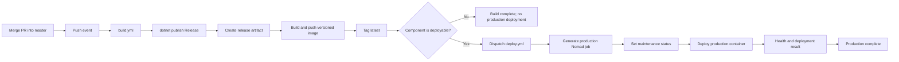
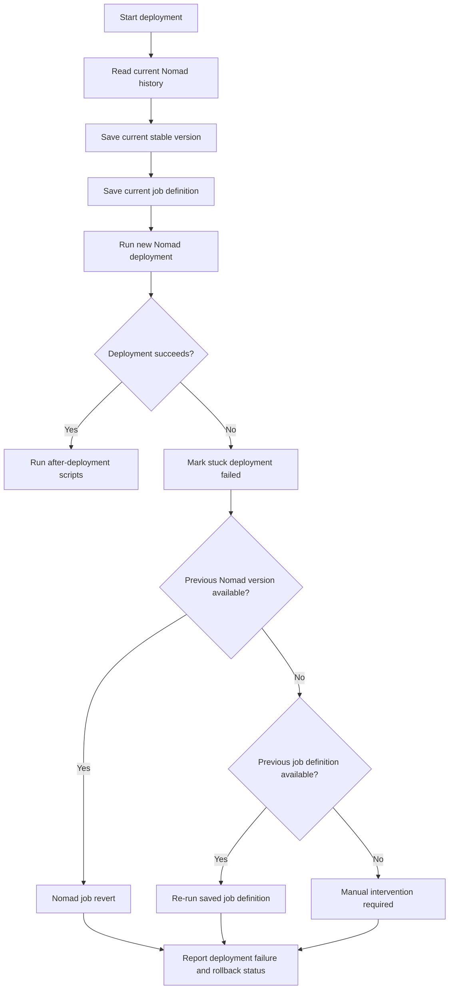

# Feature Development Lifecycle for `mfdlabs/grid-bot`

> **Repository:** `mfdlabs/grid-bot`  
> **Default branch:** `master`  
> **Primary stack:** C#/.NET 8, Docker, GitHub Actions, Nomad, Vault  
> **Document date:** September 17, 2026

This document describes the expected lifecycle for delivering a feature from initial proposal through production deployment. It combines the repository rules in `CONTRIBUTING.md` with the current GitHub Actions workflows and component-based deployment model.

> **Important implementation note:** The repository currently supports PR-triggered builds and deployments through authorized PR comments. Staging deployment is not automatically triggered merely by opening or updating a PR; it is requested with `#!deploy:`. Production deployment is automatically dispatched after a successful `master` build when the component is marked as deployable.

---

## 1. Development model

`grid-bot` uses a **trunk-based, pull-request-driven development model**:

```text
Issue
  │
  ▼
Short-lived operation branch
  │
  ▼
Pull request → master
  │
  ├── Build artifact and Docker image
  ├── Optional staging deployment
  ├── Review and validation
  │
  ▼
Merge into master
  │
  ▼
Production build and deployment
```

The normal integration branch is `master`. Contributors create a separate branch for every change, open a pull request, receive code review, and merge into `master` only after the change is ready.

The repository does not require every feature to pass through a permanent `develop` branch. Instead, the `dev` branch prefix is reserved for team-specific release or integration branches:

```text
feature/<fixture>
fix/<fixture>
enhancement/<fixture>
ops/<fixture>
hotfix/<fixture>
dev/<team-name>/<fixture>
```

This model provides:

- Small, reviewable changes.
- A clear relationship between an issue, branch, and pull request.
- Buildable and deployable artifacts before merge.
- A single production integration point: `master`.
- Fast rollback through Nomad deployment history.

The relevant repository rules are defined in [`CONTRIBUTING.md`](https://github.com/mfdlabs/grid-bot/blob/master/CONTRIBUTING.md).

---

# 2. End-to-end feature lifecycle

## Lifecycle overview



---

## 3. Step 1 — Open and define the issue

Unless the change is a hotfix, the repository requires a related GitHub issue before opening a pull request.

A feature issue should explain:

- The problem being solved.
- The desired user-visible behavior.
- The affected services or libraries.
- Functional requirements.
- Non-functional requirements such as performance, security, or compatibility.
- Configuration or Vault changes.
- How the feature will be tested.
- Deployment and rollback considerations.
- Any limitations or migration requirements.

The feature request template is located at:

```text
.github/ISSUE_TEMPLATE/feature_request.yml
```

The template automatically applies:

```text
kind: feature
kind: enhancement
status: backlogged
status: needs-review
```

A good issue should contain acceptance criteria such as:

```markdown
## Acceptance criteria

- [ ] The new command is available to authorized Discord users.
- [ ] Invalid input returns a user-friendly error.
- [ ] The feature is covered by automated tests.
- [ ] The feature works with the development configuration.
- [ ] The feature works in staging with production-like configuration.
- [ ] Metrics and logs are available.
- [ ] The change can be rolled back without data loss.
```

### Issue-to-code traceability

The issue should remain linked to the branch and pull request. A typical relationship is:

```text
Issue #123
   │
   ├── Branch: feature/123-render-cache
   │
   └── Pull request: feature/123-render-cache → master
```

The pull request should reference the issue using GitHub syntax where appropriate:

```text
Closes #123
```

For non-hotfix work, the issue is the source of truth for the feature scope. Pull requests should focus on implementation details, validation results, and deployment information.

---

# 4. Step 2 — Apply labels

`CONTRIBUTING.md` requires every issue and pull request to include labels prefixed with:

```text
kind:
priority:
```

Other labels are optional but useful for routing, operational ownership, and filtering.

## Common `kind:` labels

Examples found in the repository include:

| Label | Use |
|---|---|
| `kind: feature` | A new user-visible capability. |
| `kind: enhancement` | An improvement to an existing capability or repository behavior. |
| `kind: fix` | A normal bug fix. |
| `kind: hotfix` | An urgent production or security fix. |
| `kind: appeal` | A blacklist or moderation appeal. |

## Common `priority:` labels

Examples include:

| Label | Use |
|---|---|
| `priority: deliverable` | Important work planned for delivery. |
| `priority: key deliverable` | Critical, urgent, or high-impact work. |

## Common status labels

| Label | Use |
|---|---|
| `status: backlogged` | Accepted but not currently being implemented. |
| `status: needs-review` | Requires product, technical, or maintainer review. |
| `status: required-review` | Requires an explicit review before progressing. |

## Area and operational labels

Recent pull requests use labels such as:

```text
area: github
area: ci-cd
area: code-ops
area: discord
opsec: ci-cd
opsec: repo-ops
opsec: we-love-clean-code
platform: linux
platform: windows
platform: mac-os
```

These labels help identify:

- The system area affected.
- The operational or security implications.
- The target platform.
- The reviewers or maintainers who should be involved.

A typical feature issue might use:

```text
kind: feature
priority: deliverable
status: backlogged
status: needs-review
area: discord
```

A CI/CD change might use:

```text
kind: enhancement
priority: deliverable
area: ci-cd
area: code-ops
opsec: ci-cd
```

A production security issue might use:

```text
kind: hotfix
priority: key deliverable
status: required-review
```

---

# 5. Step 3 — Create the branch

Create one new branch for each independent change. Do not combine unrelated work in the same branch.

The branch must follow the organization naming format:

```text
{operation}/{fixture}
```

or, for a team-specific branch:

```text
{operation}/{teamName}/{fixture}
```

Allowed operation prefixes are:

```text
feature
ops
fix
enhancement
dev
hotfix
```

## Examples

```text
feature/123-render-cache
enhancement/123-improve-command-errors
fix/456-null-reference-in-render-pipeline
ops/789-update-discord-dependency
hotfix/901-production-auth-failure
dev/grid-team/quarterly-release
```

The fixture should:

- Be short but descriptive.
- Use only letters, numbers, hyphens, and underscores.
- Include the issue number when possible.
- Include a Jira or backlog identifier when applicable.

## Recommended commands

```bash
git clone https://github.com/mfdlabs/grid-bot.git
cd grid-bot

git fetch origin
git checkout master
git pull --ff-only origin master

git checkout -b feature/123-render-cache
```

The branch should be based on the latest `master` unless the change explicitly belongs to a team-specific integration branch.

---

# 6. Step 4 — Check out and prepare the local environment

The primary service is a .NET 8 executable located at:

```text
services/grid-bot/src/Grid.Bot.csproj
```

The repository also contains:

```text
services/recovery/
lib/
proto/
scripts/
targets/
```

The main bot references shared libraries for commands, events, settings, gRPC, web functionality, configuration, Redis, and utility behavior.

The build configuration is defined centrally in:

```text
services/Directory.Build.props
```

Important properties include:

```text
TargetFramework: net8.0
Configurations: debug;release
InformationalVersion:
  dev when CI is false
  IMAGE_TAG when CI is true
```

The main service is packaged into a Docker image using:

```text
services/grid-bot/Dockerfile
```

## Local configuration

Grid Bot supports configuration through:

1. Environment variables.
2. HashiCorp Vault.

Vault is the preferred deployment configuration source. Local development normally uses the `development` environment:

```text
ENVIRONMENT=development
```

Configuration values may include:

```text
BotToken
GridServerImageName
GridServerImageTag
GridServerSettingsKey
VAULT_ADDR
VAULT_TOKEN
VAULT_MOUNT
ENVIRONMENT
```

Secrets must not be committed to the repository. Use local environment variables, a local development Vault instance, or an approved development secret mechanism.

---

# 7. Step 5 — Implement the feature

Implementation should follow the existing structure of the repository.

A feature may touch one or more of the following areas:

```text
services/grid-bot/
  Main Discord bot service

services/recovery/
  Recovery and health-check sidecar

lib/clients/
  HTTP clients for external Roblox APIs

lib/configuration/
  Shared configuration infrastructure

lib/grid/
  Grid Server clients, commands, process management, and diagnostics

lib/floodcheckers/
  Rate limiting and anti-spam behavior

lib/vault/
  Vault integration

proto/
  gRPC protocol definitions

services/*/.component.yaml
  Build and deployment definition for each deployable component
```

## Implementation expectations

New code should:

- Follow the style of the surrounding file.
- Include documentation comments where required by the contributing rules.
- Reuse existing abstractions where possible.
- Avoid adding unrelated refactoring.
- Add or update tests.
- Update documentation when user-facing behavior changes.
- Add configuration defaults and validation where necessary.
- Add metrics and structured logging for operationally important behavior.
- Consider development, staging, and production configuration differences.

For a feature affecting the gRPC API, update:

```text
proto/grid_bot.proto
```

For a feature affecting deployment, inspect:

```text
services/grid-bot/.component.yaml
services/recovery/.component.yaml
```

The component manifest defines:

- The project to publish.
- Additional MSBuild arguments.
- Docker image information.
- Nomad job and namespace.
- Resource requirements.
- Environment-specific placement.
- Vault role.
- Health checks.
- Pre-deployment and post-deployment scripts.

---

# 8. Step 6 — Test locally using Debug builds

Local testing should use a **Debug build** during initial development.

Example:

```bash
dotnet restore services/grid-bot/src/Grid.Bot.csproj

dotnet build \
  services/grid-bot/src/Grid.Bot.csproj \
  --configuration Debug
```

Run the service using development configuration:

```bash
ENVIRONMENT=development \
dotnet run \
  --project services/grid-bot/src/Grid.Bot.csproj \
  --configuration Debug
```

On PowerShell:

```powershell
$env:ENVIRONMENT = "development"
$env:BotToken = "development-token"

dotnet run `
  --project services/grid-bot/src/Grid.Bot.csproj `
  --configuration Debug
```

Run available tests from the repository:

```bash
dotnet test \
  --configuration Debug \
  --no-restore
```

If only a specific test project is relevant:

```bash
dotnet test path/to/Relevant.Tests.csproj --configuration Debug
```

## What local Debug testing is for

Local Debug testing is intended to verify:

- Compilation and project references.
- Fast feedback while implementing.
- Breakpoints and interactive debugging.
- Basic command and service behavior.
- Unit tests and developer-focused integration tests.
- Error handling and edge cases.
- Changes to configuration providers.
- Changes to protocol clients or process management.

Local Debug testing should not be treated as proof that the feature is production-ready. It typically differs from deployed environments in:

- Secrets.
- Network topology.
- Vault policies.
- Nomad scheduling.
- Container filesystem behavior.
- TLS certificates.
- Redis or external service endpoints.
- Discord permissions and production guild configuration.
- Resource constraints.
- Logging and metrics aggregation.

---

# 9. Development testing versus staging testing

Development and staging are deliberately different validation environments.

## Development environment

Development testing is optimized for speed and diagnosis.

Typical characteristics:

```text
Build: Debug
Execution: local dotnet run or local container
Configuration: development
Secrets: developer-provided or development Vault path
Logging: verbose
Debugging: breakpoints and local inspection enabled
Data: disposable or synthetic
Deployment: manual/local
```

Development testing should answer:

- Does the code compile?
- Does the feature work in isolation?
- Are unit and integration tests passing?
- Are invalid inputs handled?
- Do logs make failures diagnosable?
- Does the feature work with development dependencies?
- Does the feature behave correctly when external dependencies fail?

## Staging environment

Staging is optimized for deployment realism and release validation.

The current deployment workflow maps staging to:

```text
Nomad environment: staging
Short environment: stage
Roblox environment: sitetest3
```

Production maps to:

```text
Nomad environment: production
Short environment: prod
Roblox environment: sitetest1
```

Staging validation should use:

```text
Build: normally Release
Execution: Docker image deployed to Nomad
Configuration: staging Vault path
Secrets: staging-managed secrets
Logging: production-like collection
Networking: staging ingress and service discovery
Resources: staging Nomad CPU and memory allocations
Data: staging or representative data
Deployment: GitHub Actions and Nomad
```

Staging testing should answer:

- Does the published artifact start correctly?
- Does the Docker image contain all runtime files?
- Do Vault and environment-variable substitutions work?
- Does the service register its ports and health checks?
- Does the service work through staging ingress?
- Does the feature work with production-like Discord, Redis, HTTP, gRPC, and Grid Server dependencies?
- Does deployment maintenance mode work?
- Are metrics available?
- Does the service recover after restart?
- Does rollback restore a working version?

## Main distinction

```text
Development:
  "Does the feature work in code?"

Staging:
  "Does the built and deployed artifact work in an environment that resembles production?"
```

A feature should not be approved solely because it passes local Debug testing.

---

# 10. Step 7 — Push the branch

Before pushing, check the working tree and review the change:

```bash
git status
git diff --check
git diff
```

Run the local build and tests again:

```bash
dotnet build services/grid-bot/src/Grid.Bot.csproj -c Debug
dotnet test -c Debug
```

Commit the change:

```bash
git add services lib proto .github
git commit -m "Add render cache support"
```

Signed commits are preferred. If configured locally:

```bash
git commit -S -m "Add render cache support"
```

Push the branch:

```bash
git push --set-upstream origin feature/123-render-cache
```

The branch should not be deleted after merging. This is an explicit repository rule.

---

# 11. Step 8 — Open the pull request

Open a pull request from the operation branch into `master`.

The pull request should include:

- A concise summary.
- A link to the issue.
- Scope of the implementation.
- Design decisions.
- Configuration changes.
- Test results.
- Local Debug validation.
- Staging validation results.
- Deployment instructions.
- Rollback instructions.
- Known limitations.
- Screenshots or logs for user-facing changes.

Example PR structure:

```markdown
## Summary

Adds server-side caching for rendered avatars.

## Related issue

Closes #123

## Changes

- Adds the render cache service.
- Adds cache configuration.
- Adds cache hit and miss metrics.
- Adds unit tests.
- Updates deployment documentation.

## Validation

- [x] Local Debug build
- [x] Unit tests
- [x] PR Release build
- [x] Staging deployment
- [x] Staging smoke test
- [ ] Production deployment

## Rollback

If the deployment is unhealthy:

#!prod-rollback: grid-bot
```

All pull requests must be reviewed, even if the author is a repository administrator. The repository `CODEOWNERS` file assigns ownership to:

```text
@mfdlabs/grid-team
@ mfdlabs/who-owns-this-sector
```

The actual file uses the GitHub team entries without the space shown above.

---

# 12. Step 9 — Create a build on the pull request

The repository supports an authorized PR comment command for building a component:

```text
#!build: grid-bot
```

A Debug PR build can be requested with:

```text
#!build: grid-bot@debug
```

The build command supports an optional version suffix:

```text
#!build: grid-bot:rc1
#!build: grid-bot:rc1@debug
```

The PR build workflow:

1. Verifies that the comment was made on a pull request.
2. Verifies that the commenter belongs to the authorized deployment team.
3. Parses the component and build configuration.
4. Dispatches `build.yml` against the PR branch.
5. Publishes the compiled artifact.
6. Creates a Docker image.
7. Adds the release and image information back to the PR.

The relevant workflow is:

```text
.github/workflows/build-via-pr.yml
```

## Release and Debug builds

The build workflow supports:

```text
Release
Debug
```

Release builds are the normal candidate for staging and production. Debug builds are useful for developer diagnostics, but they should not be used as a substitute for release validation.

Build versions are generated from:

```text
yyyy.MM.dd-HH.mm.ss-shortsha
```

Debug builds receive a `-dev` suffix.

For example:

```text
2026.09.17-14.38.43-65562b6-dev
```

The component manifest points the build at:

```text
services/grid-bot/src/Grid.Bot.csproj
```

The output is packaged and used to build:

```text
mfdlabs/grid-bot:<version>
```

---

# 13. Step 10 — Deploy the PR build to staging

After the PR build has completed, the generated PR comment contains a deployment command similar to:

```text
#!deploy: grid-bot:<version>
```

Example:

```text
#!deploy: grid-bot:2026.09.17-14.38.43-65562b6
```

The deployment workflow:

1. Verifies that the comment author is authorized.
2. Resolves the PR branch.
3. Dispatches `deploy.yml`.
4. Selects the `staging` environment.
5. Generates Nomad configuration from `.component.yaml`.
6. Applies component-specific deployment scripts.
7. Deploys the image to Nomad.
8. Reports the deployment result on the PR.

The PR deployment workflow maps the command as follows:

```text
#!deploy:       staging
#!prod-deploy:  production
```

Therefore, the normal PR validation sequence is:

```text
#!build: grid-bot
#!deploy: grid-bot:<generated-version>
```

## Staging deployment sequence



The `grid-bot` component has a pre-deployment script that:

- Downloads `grpcurl`.
- Downloads the protocol definition for the target version.
- Checks whether the current bot is healthy.
- Sets maintenance mode before deployment.
- Waits for maintenance state propagation.

This behavior is defined in:

```text
services/grid-bot/.component.yaml
```

---

# 14. Step 11 — Perform staging validation

Staging testing should be recorded on the pull request.

A recommended staging checklist is:

```markdown
## Staging validation

- [ ] Container starts successfully.
- [ ] Nomad job is healthy.
- [ ] HTTP endpoint responds.
- [ ] gRPC endpoint responds.
- [ ] Metrics endpoint responds.
- [ ] Discord authentication succeeds.
- [ ] Feature works through the real command path.
- [ ] Invalid input is handled correctly.
- [ ] Existing commands still work.
- [ ] Logs contain no unexpected errors.
- [ ] Vault settings are loaded correctly.
- [ ] Restart and recovery behavior are acceptable.
- [ ] No unexpected resource increase is observed.
- [ ] Rollback command has been identified.
```

Where possible, test both:

1. The new feature.
2. The existing critical paths that could have been affected.

For example, a change to shared Grid Server or Discord infrastructure should test:

- Rendering.
- Script execution.
- Command authorization.
- Rate limiting.
- Guild locking.
- Error responses.
- Metrics and health checks.

---

# 15. Step 12 — Review and merge

A pull request is ready to merge when:

- The linked issue is understood and correctly implemented.
- Required `kind:` and `priority:` labels are present.
- The branch follows naming rules.
- The PR has been reviewed by the appropriate code owner.
- Local tests pass.
- The PR build succeeds.
- Staging validation is complete.
- Documentation is updated where required.
- Configuration and secrets have been reviewed.
- Rollback instructions are available.
- No unrelated changes remain.

The normal merge target is:

```text
master
```

The branch should not be deleted after the merge, according to the repository contribution rules.

---

# 16. Step 13 — Build after merging into `master`

The normal `build.yml` workflow runs on pushes to `master` when relevant paths change:

```text
lib/**
services/**
.github/workflows/build.yml
```

The master build:

1. Determines the affected components.
2. Checks out the repository.
3. Installs .NET 8.
4. Finds component manifests under `services/`.
5. Generates a version.
6. Runs `dotnet publish`.
7. Packages the component.
8. Creates a GitHub release.
9. Builds and pushes the Docker image.
10. Tags the master image as `latest`.

Component selection can be controlled through commit message markers:

```text
#!components: grid-bot
#!deployable-components: grid-bot
```

Build suppression markers include:

```text
#!skip-build!#
#!skip-release!#
#!skip-image!#
#!skip-deploy!#
```

These markers should be used carefully because they change the release pipeline behavior.

---

# 17. Step 14 — Automatic production deployment

After a successful `master` build, the workflow automatically dispatches production deployment for components listed as deployable.

The relevant behavior is in:

```text
.github/workflows/build.yml
```

The production deployment uses:

```text
nomad_environment: production
```

The deployment workflow then:

- Resolves the component directory.
- Reads `.component.yaml`.
- Substitutes environment variables.
- Generates Nomad jobs.
- Runs pre-deployment scripts.
- Deploys the versioned image.
- Waits for Nomad deployment completion.
- Runs post-deployment scripts.
- Updates GitHub deployment status.
- Comments the result on the related pull request when available.



Production should always deploy a versioned image, not an untracked local build. The version is embedded into the component build and Docker image tags.

---

# 18. Deployment environments

The deployment workflow accepts two environments:

```text
staging
production
```

The environment affects:

- Nomad job naming.
- Nomad namespace configuration.
- Vault role.
- Vault settings.
- External service routing.
- Roblox environment selection.
- Ingress hostnames.
- Resource allocations.
- Deployment approvals and secrets.
- Maintenance status messages.

The deployment workflow uses separate GitHub environment contexts:

```text
environment: staging
environment: production
```

This allows environment-specific variables and secrets to be applied by GitHub Actions.

The component manifest also defines environment-dependent values such as:

```text
NOMAD_ENVIRONMENT
NOMAD_SHORT_ENVIRONMENT
RBX_ENVIRONMENT
VAULT_ADDR
VAULT_TOKEN
NOMAD_VERSION
NOMAD_CPU
NOMAD_RAM
```

---

# 19. Rollback procedures

Rollback is supported both automatically and manually.

## Automatic rollback during a failed deployment

Before replacing a Nomad job, `deploy.yml` records:

- The current Nomad version.
- The current stable version.
- The current Nomad job definition.

If the new deployment fails, the workflow attempts to:

1. Mark a stuck deployment as failed if necessary.
2. Revert to the previous stable Nomad version.
3. Fall back to the previously inspected job definition if a version revert is unavailable.
4. Report whether rollback succeeded.



Automatic rollback is not attempted during a dry run.

## Manual rollback

A rollback can be triggered from an authorized pull request comment:

```text
#!rollback: grid-bot
```

This rolls back staging to the previous stable version.

For production:

```text
#!prod-rollback: grid-bot
```

A specific Nomad version can be provided:

```text
#!prod-rollback: grid-bot,123
```

The rollback workflow supports:

```text
component
nomad_environment
nomad_namespace
force_version
```

If `force_version` is omitted, the workflow searches Nomad history for the previous stable version.

The workflow then:

1. Resolves the Nomad job name.
2. Reads deployment history.
3. Selects the requested or previous stable version.
4. Runs `nomad job revert`.
5. Checks the resulting Nomad job status.
6. Updates GitHub deployment status.
7. Adds the rollback result to the PR.

## Manual rollback through Actions

The same process can be started through the `rollback.yml` workflow dispatch interface:

```text
Component: grid-bot
Environment: production
Namespace: grid-bot
Force version: optional
```

## Rollback limitations

Rollback requires:

- Retained Nomad job history.
- A matching Nomad job name.
- An existing previous stable version or saved job definition.
- Access to the correct Nomad environment.
- Valid Nomad credentials.
- A functioning image or job definition for the target version.

If the deployment has changed a data schema or external contract, rolling back the application binary alone may not be safe. Such changes require an explicit backward-compatibility or migration plan.

---

# 20. Hotfix lifecycle

Hotfixes use the same pull-request model but may skip the normal feature discussion requirement when immediate production remediation is necessary.

Use:

```text
hotfix/<fixture>
```

Example:

```text
hotfix/901-prod-auth-failure
```

A hotfix should still:

- Have a descriptive pull request.
- Include the relevant `kind: hotfix` label.
- Include an appropriate priority label.
- Receive code review where possible.
- Be tested locally.
- Be validated in staging when time and safety permit.
- Have an explicit rollback plan.
- Document the production impact and remediation.

After the hotfix is merged, a follow-up issue may be required for:

- Root-cause analysis.
- Missing automated tests.
- Documentation.
- Monitoring improvements.
- Long-term architectural fixes.

---

# 21. Pull request commands

The following commands are supported by the PR workflows.

## Build

```text
#!build: <component>
```

Examples:

```text
#!build: grid-bot
#!build: recovery
#!build: grid-bot@debug
#!build: grid-bot:rc1
#!build: grid-bot:rc1@debug
```

## Deploy to staging

```text
#!deploy: <component>:<version>
```

Example:

```text
#!deploy: grid-bot:2026.09.17-14.38.43-65562b6
```

Optional resource override:

```text
#!deploy: grid-bot:2026.09.17-14.38.43-65562b6,1000:2048
```

## Deploy to production

```text
#!prod-deploy: <component>:<version>
```

Example:

```text
#!prod-deploy: grid-bot:2026.09.17-14.38.43-65562b6
```

Production deployment should normally happen through the merged `master` workflow rather than manually from a PR, unless an authorized operator needs to redeploy a known artifact.

## Roll back staging

```text
#!rollback: <component>
#!rollback: <component>,<nomad-version>
```

## Roll back production

```text
#!prod-rollback: <component>
#!prod-rollback: <component>,<nomad-version>
```

All build, deploy, and rollback PR commands are authorization-controlled. The workflows check membership in the appropriate development team before dispatching the underlying workflow.

---

# 22. Operational and security considerations

## Secrets

Do not place secrets in:

- Source files.
- `.component.yaml`.
- Dockerfiles.
- Commit messages.
- PR comments.
- Release artifacts.
- Test fixtures.

Production secrets are supplied through GitHub Actions secrets, GitHub environment configuration, Nomad, and Vault.

## Maintenance mode

The `grid-bot` component sets a maintenance status before deployment where possible. This reduces the chance that users interact with the service while the container is being replaced.

The pre-deployment process checks whether the service is alive before attempting to update its status. If the service is already unavailable, the maintenance update is skipped.

## Observability

A production-ready feature should provide:

- Structured logs.
- Metrics where appropriate.
- Health-check behavior.
- Deployment output.
- Error details that do not expose secrets.
- Enough context to correlate failures with the component version.

The component exposes metrics, HTTP, and gRPC ports through Nomad service definitions.

## Data compatibility

Before merging a feature that changes persistence or external contracts, document:

- Whether the change is backward compatible.
- Whether old and new versions can run simultaneously.
- Whether rollback is safe.
- Whether a data migration is reversible.
- Whether the migration must happen before or after deployment.

---

# 23. Definition of done

A feature is complete when all applicable conditions are satisfied:

```markdown
- [ ] A GitHub issue describes the feature.
- [ ] The issue has required kind and priority labels.
- [ ] A correctly named operation branch was created.
- [ ] The feature was implemented without unrelated changes.
- [ ] Documentation comments and user documentation were updated.
- [ ] Local Debug build passes.
- [ ] Local tests pass.
- [ ] A pull request targets master.
- [ ] Code owners reviewed the pull request.
- [ ] A PR build produced a versioned artifact and image.
- [ ] The artifact was deployed to staging.
- [ ] Staging smoke and regression tests passed.
- [ ] Configuration and secret changes were reviewed.
- [ ] Rollback instructions were documented.
- [ ] The pull request was merged into master.
- [ ] The master Release build completed.
- [ ] Production deployment completed.
- [ ] Production health checks passed.
- [ ] The deployment version was recorded.
- [ ] Any follow-up work was captured as an issue.
```

---

# 24. Complete example

Assume issue `#123` requests a new render-cache feature.

## Create the branch

```bash
git checkout master
git pull --ff-only origin master
git checkout -b feature/123-render-cache
```

## Implement and test locally

```bash
dotnet build services/grid-bot/src/Grid.Bot.csproj -c Debug
dotnet test -c Debug
```

## Push

```bash
git add .
git commit -S -m "Add render cache support"
git push --set-upstream origin feature/123-render-cache
```

## Open the pull request

```text
feature/123-render-cache → master
```

The PR includes:

```text
Closes #123
```

## Build the PR

Add an authorized PR comment:

```text
#!build: grid-bot
```

## Deploy to staging

After the build reports version `2026.09.17-14.38.43-65562b6`:

```text
#!deploy: grid-bot:2026.09.17-14.38.43-65562b6
```

## Validate staging

Run the feature through the staging Discord and service endpoints. Record results on the PR.

## Merge

After review and successful staging validation, merge the PR into `master`.

## Production

The push to `master` triggers:

```text
Release build
Docker image push
Production deployment
Nomad health checks
Deployment status reporting
```

If production is unhealthy:

```text
#!prod-rollback: grid-bot
```

or, for a known target version:

```text
#!prod-rollback: grid-bot,122
```

---

## Repository references

- [`CONTRIBUTING.md`](https://github.com/mfdlabs/grid-bot/blob/master/CONTRIBUTING.md)
- [`README.md`](https://github.com/mfdlabs/grid-bot/blob/master/README.md)
- [`build.yml`](https://github.com/mfdlabs/grid-bot/blob/master/.github/workflows/build.yml)
- [`build-via-pr.yml`](https://github.com/mfdlabs/grid-bot/blob/master/.github/workflows/build-via-pr.yml)
- [`deploy.yml`](https://github.com/mfdlabs/grid-bot/blob/master/.github/workflows/deploy.yml)
- [`deploy-via-pr.yml`](https://github.com/mfdlabs/grid-bot/blob/master/.github/workflows/deploy-via-pr.yml)
- [`rollback.yml`](https://github.com/mfdlabs/grid-bot/blob/master/.github/workflows/rollback.yml)
- [`rollback-via-pr.yml`](https://github.com/mfdlabs/grid-bot/blob/master/.github/workflows/rollback-via-pr.yml)
- [`services/grid-bot/.component.yaml`](https://github.com/mfdlabs/grid-bot/blob/master/services/grid-bot/.component.yaml)
- [`services/Directory.Build.props`](https://github.com/mfdlabs/grid-bot/blob/master/services/Directory.Build.props)
- [`CODEOWNERS`](https://github.com/mfdlabs/grid-bot/blob/master/CODEOWNERS)
